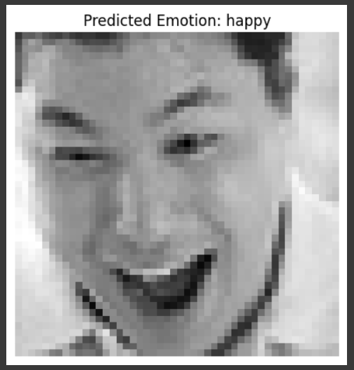

# 😃 Facial Emotion Recognition (FER2013) using CNN

This project implements a **Facial Emotion Recognition (FER)** model using the **FER2013 dataset**.  
The dataset contains **48×48 grayscale images** of faces classified into **7 emotion categories**:

- Angry  
- Disgust  
- Fear  
- Happy  
- Sad  
- Surprise  
- Neutral  

The model is built and trained using **PyTorch** on Google Colab.

---

## 📂 Dataset
- Source: [FER2013 Dataset (Kaggle)](https://www.kaggle.com/datasets/deadskull7/fer2013)  
- Structure after extraction:


---

## 🎯 Manual Testing
You can test the trained model on a **single image**:

```python
img_path = "/content/fer2013/test/happy/PrivateTest_10736786.jpg"
img = Image.open(img_path).convert("L")
img_tensor = transform(img).unsqueeze(0).to(device)

model.eval()
with torch.no_grad():
    output = model(img_tensor)
    pred = torch.argmax(output, dim=1).item()

pred_class = train_dataset.classes[pred]
print("Predicted Emotion:", pred_class)
```


## 📸 Example Prediction



